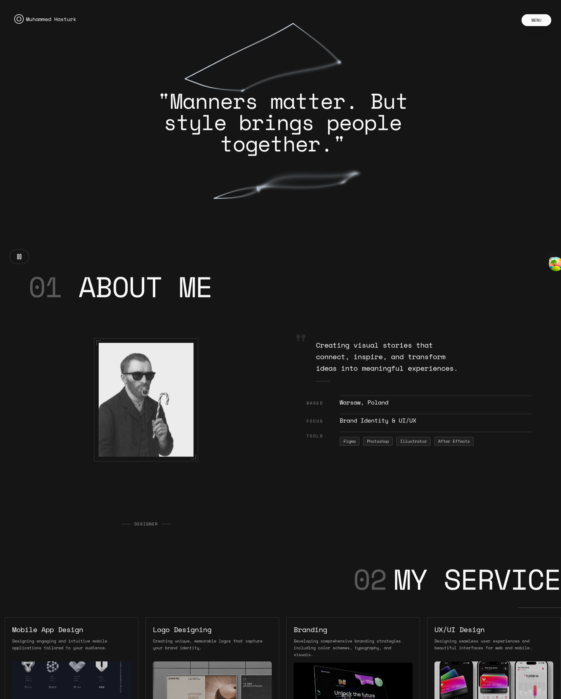
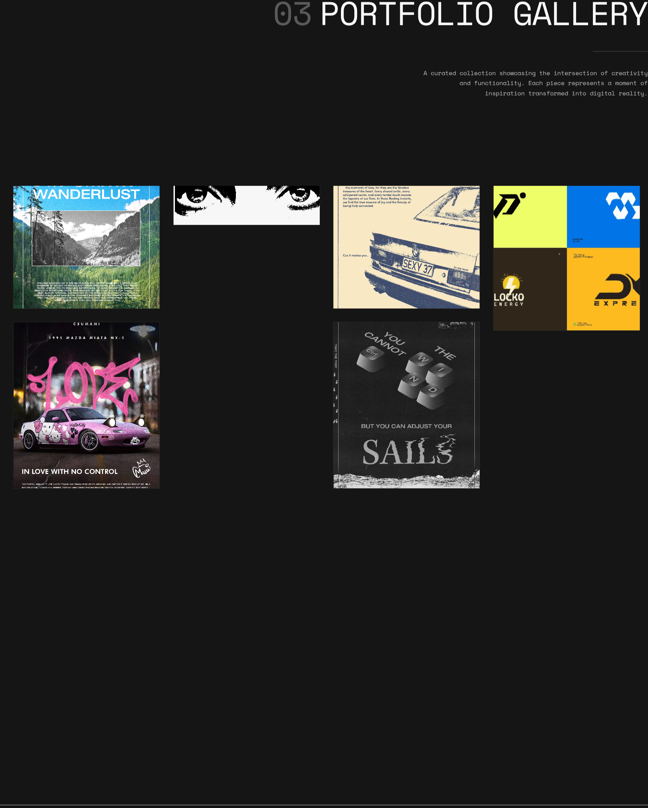
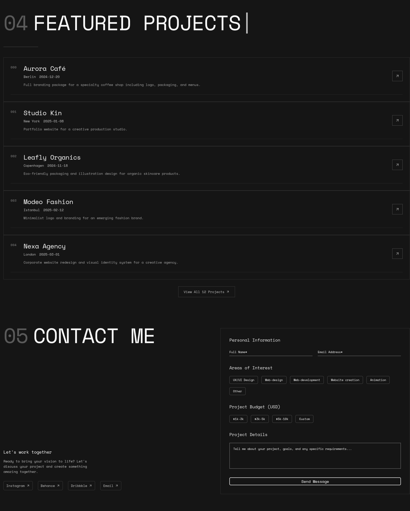

# Tanstack Start Website

Portfolio website built with React and Vite. Shows projects, about section, services, and contact form.

- **Vite** - Build tool and dev server
- **React 19** - UI library
- **TypeScript** - Type checking
- **TanStack Router + Start** - File-based routing with SSR support
- **TanStack React Query** - Server state management and data fetching
- **Tailwind CSS v4** - CSS framework
- **shadcn/ui** - UI components (Radix UI primitives)
- **Framer Motion** - Animation library
- **Supabase** - Database and storage
- **Biome** - Linter and formatter


## Preview
<div align="center">
  
  
  
</div>
## Tech Stack


- **TanStack Start** - SSR framework with `@tanstack/react-start` for server-side rendering
- **TanStack Router** - File-based routing system with type-safe navigation
- **TanStack React Query** - Data fetching, caching, and server state synchronization
- **SSR Functions** - Server-side data loading with `@tanstack/react-router-ssr-query`
- **Component Structure** - Modular UI components with shadcn/ui primitives
- **State Management** - React Query for server state, React Context for client state

## Performance

Run Lighthouse locally to check performance metrics.

## Setup

### Requirements
- Node.js 18+
- Bun package manager
- Supabase account

### Install
```bash
# Install
bun install

# Start dev server
bun run dev
```

Create `.env.local`:
```env
VITE_SUPABASE_URL=your_supabase_url
VITE_SUPABASE_ANON_KEY=your_anon_key
```

Visit `http://localhost:3000` (or port shown by Vite).

## Project Structure

- `src/routes` - File-based routing with TanStack Router
- `src/components` - Reusable UI components and page sections
- `src/lib` - Data layer (Supabase client, image helpers, utilities)
- `src/constants` - Configuration and constants
- `src/hooks` - Custom React hooks
- `src/providers` - Context providers and app state
- `src/integrations` - Third-party integrations and devtools
- `public/` - Static assets, service worker, PWA files

## Commands

| Command | Description |
|---------|-------------|
| `bun run dev` | Start dev server |
| `bun run build` | Build for production |
| `bun run start` | Start production server |
| `bun run format` | Format with Biome |
| `bun run lint` | Lint with Biome |
| `bun run typecheck` | TypeScript check |
| `bun run ui` | Add shadcn/ui components |

## Database

Supabase client in `src/lib/supabase.ts`. Database schema and migrations in `supabase/migrations`.

## Deploy

This project includes `vercel.json` for Vercel configuration. To deploy:

```bash
bun add -g vercel
vercel --prod
```

Set environment variables in your hosting platform.

## Contributing

Open issues or pull requests for bugs and improvements.